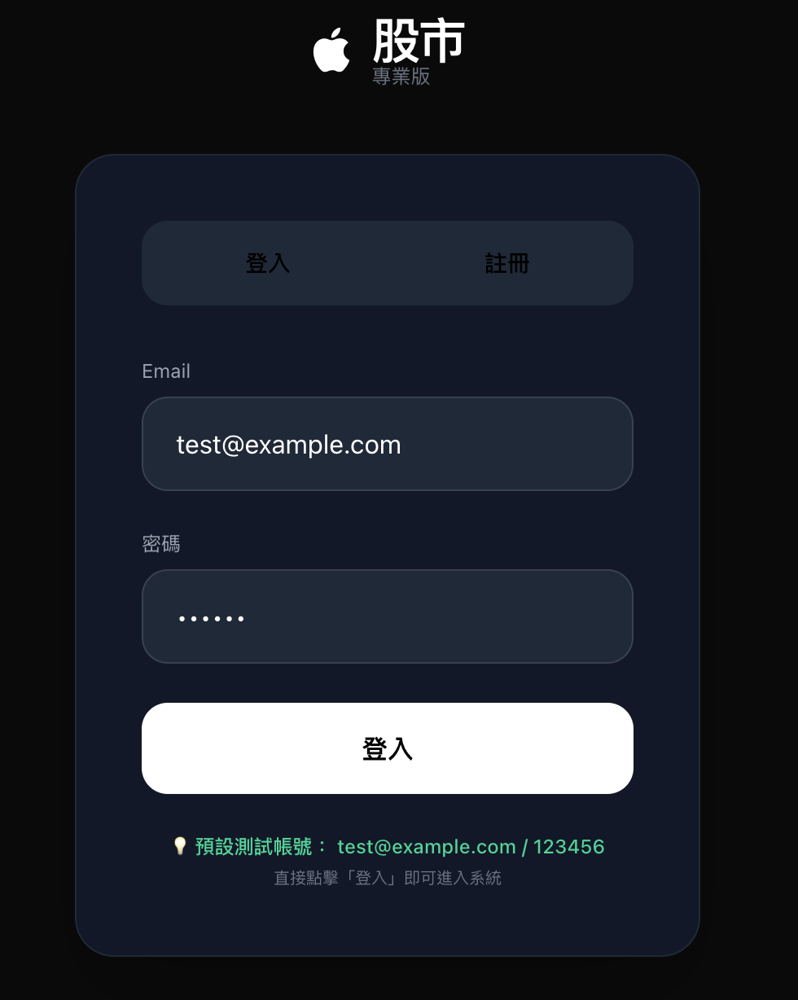
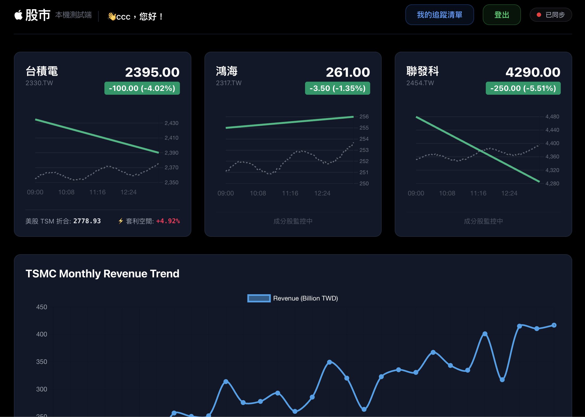
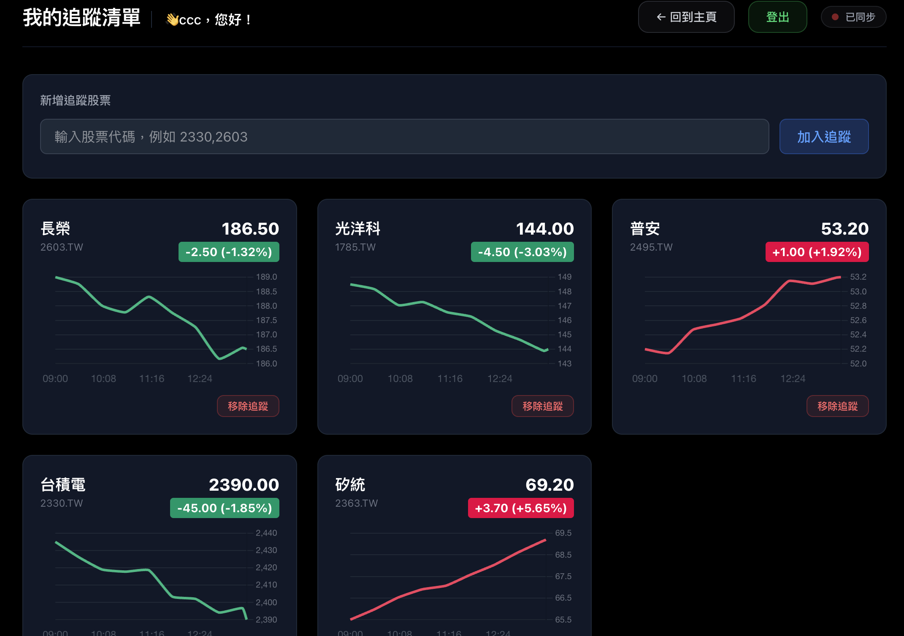
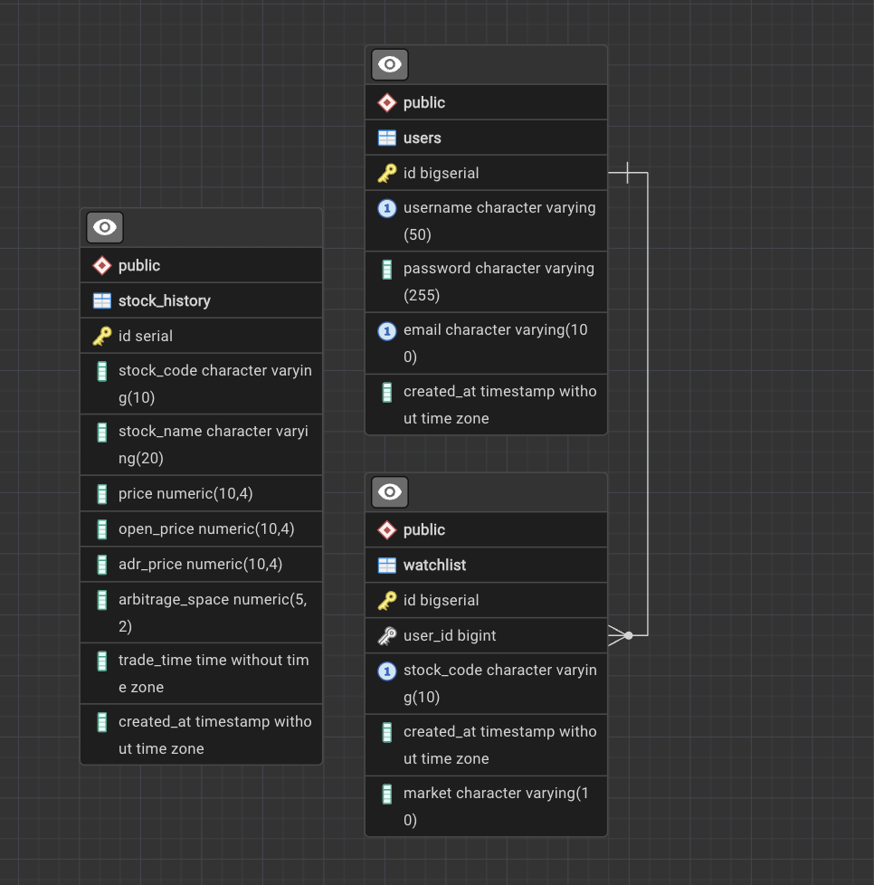

# TaiwanStockTracker

繁體中文 | [English](./README.md)

即時台股追蹤系統。整合台灣證券交易所（TWSE）即時行情、FinMind 開源金融資料 API，提供即時報價推播、月營收趨勢分析、ADR 折合套利空間計算，並支援使用者自訂股票追蹤清單。

<p align="center">
  
  
  
</p>

## 功能特色

- **即時報價推播**：透過 WebSocket（STOMP over SockJS）每 5 秒推送最新股價，無需手動刷新頁面
- **個人追蹤清單**：登入後可自由新增／刪除追蹤的股票，系統會自動驗證股票代碼是否真實存在（透過 FinMind API），並自動判斷上市（TWSE）或上櫃（TPEx）市場
- **動態抓取範圍**：定時任務會根據所有使用者目前追蹤的股票動態調整抓取清單，新增一支股票後，全站使用者都能看到該股票的即時資料
- **ADR 套利分析**：計算台積電 ADR（美股）與台股價格之間的折合與套利空間
- **月營收趨勢圖**：串接 FinMind 月營收資料，視覺化呈現公司營收走勢
- **JWT 使用者驗證**：註冊／登入機制，密碼以 bcrypt 加密儲存

## 技術棧

| 分類 | 技術 |
|---|---|
| 後端框架 | Spring Boot 3.2.5 |
| 資料庫 | PostgreSQL（手寫 JDBC，無 ORM） |
| 即時通訊 | WebSocket（STOMP + SockJS） |
| 身份驗證 | JWT（jjwt） |
| 密碼加密 | Spring Security Crypto（bcrypt） |
| 前端 | HTML + Tailwind CSS + Chart.js（原生 JS，無框架） |
| 外部資料源 | TWSE 即時行情 API、FinMind 開源金融資料 API |


## 資料庫架構

<p align="center">
  
</p>

## 專案架構

採用傳統分層架構（MVC + DAO），不使用 Spring Data JPA，所有 SQL 皆手寫並透過 `PreparedStatement` 執行：

```
com/
├── Main.java                  # 應用程式入口，定時任務排程
├── controller/                 # REST API 入口
│   ├── AuthController          # 註冊／登入／取得當前使用者
│   └── WatchlistController     # 追蹤清單 CRUD
├── service/                    # 業務邏輯層
│   ├── impl/StockServiceImpl   # 股價抓取與儲存邏輯
│   └── impl/AuthServiceImpl    # 帳號認證邏輯
├── dao/                         # 資料庫存取層（手寫 SQL）
│   └── impl/                   # StockDaoImpl, UserDaoImpl, WatchlistDaoImpl
├── client/                      # 外部 API 客戶端
│   ├── TwseClient               # 證交所即時行情
│   ├── FinMindClient             # FinMind 月營收／股價資料
│   ├── AdrClient                 # 美股 ADR 報價
│   └── FxRateClient              # 匯率資料
├── model/                       # 資料模型（Entity）
├── util/                        # 工具類別（DBUtil, JwtUtil, FinMindConfig...）
└── config/                      # WebSocket 設定
```

## 環境設定

### 必要條件

- JDK 17+
- Maven 3.8+
- PostgreSQL 14+

### 1. 資料庫建立

```sql
CREATE DATABASE stocktracker;

CREATE TABLE users (
    id SERIAL PRIMARY KEY,
    username VARCHAR(50) UNIQUE NOT NULL,
    password VARCHAR(255) NOT NULL,
    email VARCHAR(100)
);

CREATE TABLE stock_history (
    id SERIAL PRIMARY KEY,
    stock_code VARCHAR(10) NOT NULL,
    stock_name VARCHAR(50) NOT NULL,
    price NUMERIC,
    open_price NUMERIC,
    adr_price NUMERIC,
    arbitrage_space NUMERIC,
    trade_time TIME,
    created_at TIMESTAMP DEFAULT CURRENT_TIMESTAMP
);

CREATE TABLE watchlist (
    id SERIAL PRIMARY KEY,
    user_id INTEGER NOT NULL,
    stock_code VARCHAR(10) NOT NULL,
    market VARCHAR(10) DEFAULT 'twse',
    UNIQUE(user_id, stock_code)
);
```

### 2. 環境變數設定

本專案不在程式碼中寫死任何 API 金鑰，所有敏感資訊一律透過環境變數注入。

```bash
export FINMIND_TOKEN="你的 FinMind API Token"
```

> FinMind Token 可至 [FinMind 使用者資訊頁面](https://finmindtrade.com/analysis/#/account/user) 註冊後取得。
> 若懷疑 Token 外流，可在該頁面點選「更新 Token」立即讓舊金鑰失效。

資料庫連線設定請依實際環境調整 `DBUtil.java` 或 `application.properties`。

### 3. 啟動專案

```bash
mvn clean install
mvn spring-boot:run
```

啟動後開啟瀏覽器前往：

```
http://localhost:8080/login.html
```

## API 文件

### 認證 `/api/auth`

| Method | 路徑 | 說明 |
|---|---|---|
| POST | `/api/auth/register` | 註冊新帳號 |
| POST | `/api/auth/login` | 登入，回傳 JWT token |
| GET | `/api/auth/me` | 取得目前登入使用者資訊（需帶 token） |

### 追蹤清單 `/api/watchlist`（需帶 `Authorization: Bearer <token>`）

| Method | 路徑 | 說明 |
|---|---|---|
| GET | `/api/watchlist` | 取得目前使用者的追蹤清單 |
| POST | `/api/watchlist` | 新增追蹤股票（body: `{"stockCode":"2330"}`），會驗證代碼真實性並自動判斷市場 |
| DELETE | `/api/watchlist/{stockCode}` | 移除追蹤的股票 |

### 股票資料

| Method | 路徑 | 說明 |
|---|---|---|
| GET | `/api/history` | 取得資料庫中所有股票的歷史報價紀錄 |
| GET | `/api/chart-overlay` | 取得今日／昨日重疊走勢圖資料 |
| GET | `/api/financial-summary` | 取得財務摘要（ADR 套利分析等） |
| GET | `/api/revenue-history` | 取得月營收歷史趨勢 |
| GET | `/api/previous-close/{stockCode}` | 取得指定股票的前一交易日收盤價 |

### WebSocket

```
連線端點: /ws
訂閱主題: /topic/stock
```

每 5 秒推播一次最新股價，前端範例：

```javascript
const socket = new SockJS('/ws');
const stompClient = Stomp.over(socket);
stompClient.connect({}, () => {
    stompClient.subscribe('/topic/stock', (message) => {
        const data = JSON.parse(message.body);
        console.log(data);
    });
});
```

## 安全性注意事項

- 所有 API 金鑰皆透過環境變數讀取，**請勿將金鑰寫死於程式碼或提交至版本控制**
- `.gitignore` 已排除 `.env`、`application-local.properties` 等可能含敏感資訊的檔案
- 密碼使用 bcrypt 雜湊後儲存，不存放明文密碼
- 若懷疑任何金鑰已外流，請立即至對應服務的後台重新產生金鑰

## License

本專案資料來源（TWSE、FinMind）之使用條款請參閱各自官方網站。